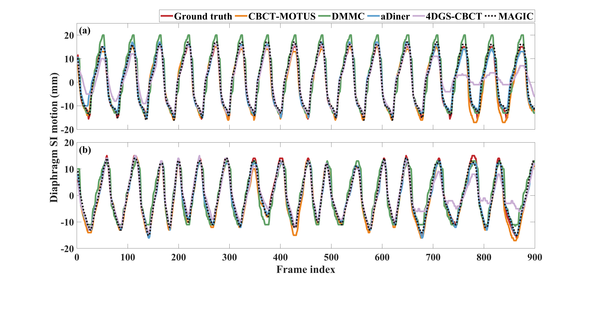
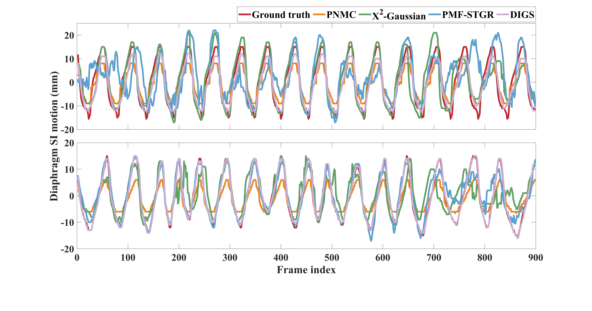
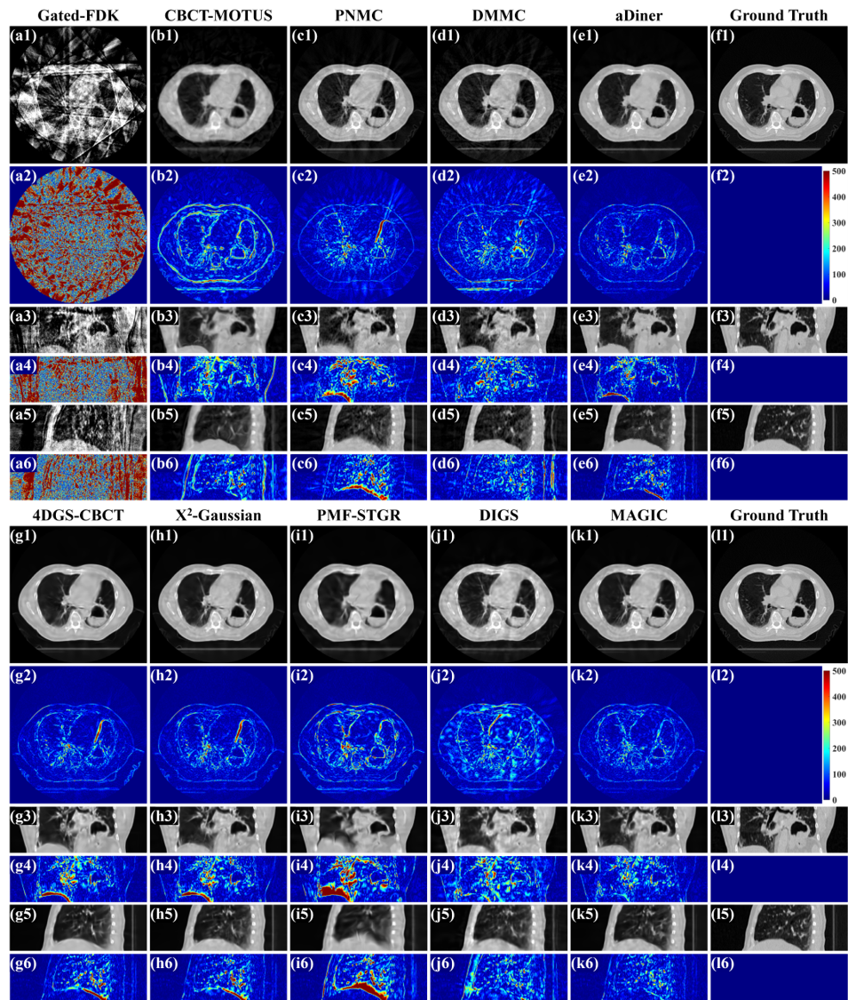
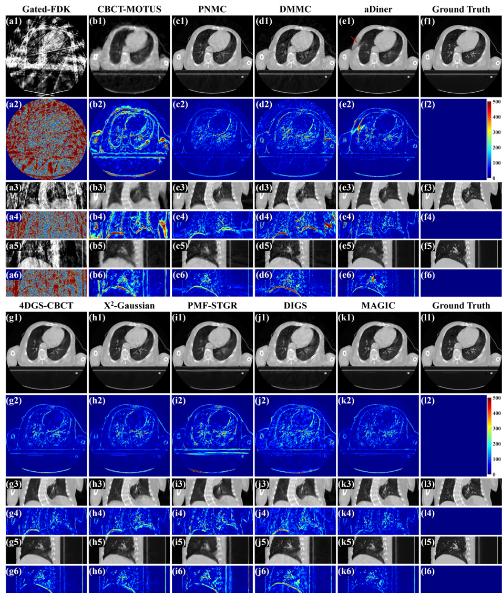
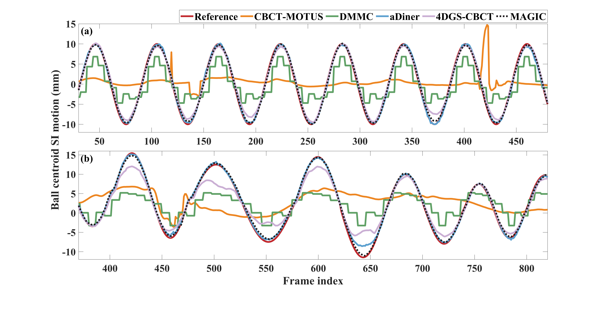
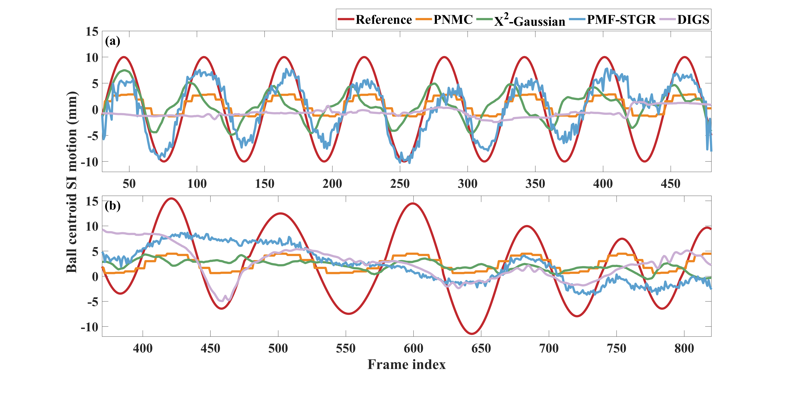

# MAGIC: Motion-aware Gaussian Splatting in Dynamic CBCT Imaging

Author: Yufu Zhou, Hua Chen, Yi Liu, Ziheng Deng, Jun Zhao

This repository is the official implementation of MAGIC: Motion-aware Gaussian Splatting in Dynamic CBCT Imaging. 

The dynamic demos are available in [MAGIC](https://henryzyf.github.io/MAGIC/). The MP4 files can be downloaded from this repository.

**Abstract**:
Dynamic cone-beam computed tomography (CBCT) provides time-resolved visualization of respiratory motion, which is crucial for precise target localization in the lung radiotherapy. While recent implicit neural representation (INR) methods have shown promise in modeling continuous spatiotemporal scenes, they are often computationally expensive. In this work, we propose a novel dynamic CBCT reconstruction framework, Motion-Aware Gaussian splatting In dynamic CBCT imaging (MAGIC), for accurate and efficient reconstruction. Instead of implicit neural networks, MAGIC represents the dynamic scene using learnable Gaussian primitives, which reduces reconstruction time and maintains representation flexibility. We introduce a motion-aware decomposition (MADE) method for Gaussians to decouple quasi-static anatomical components and motion variations. The decomposition allows the network to focus its capacity on the deformation of dynamic regions, which facilitates more accurate motion modeling and shortens reconstruction time. Furthermore, we design a respiratory deformation network (RED) with an encoder of ten feature planes (Deca-Planes) to effectively capture inter- and intra-cycle similarities from quasi-periodic respiration, thus improving motion estimation accuracy. Experiments on simulated data, a physical phantom and clinical data demonstrate that compared to other methods, MAGIC achieves higher image quality and motion fidelity while accelerating reconstruction. These results indicate that MAGIC offers an effective and efficient alternative for dynamic CBCT imaging in the respiration-related radiotherapy.

<b>Figure 1 (Part 1). Reconstructed diaphragm SI (Superior-Inferior) motion curves in the simulated dataset. (a) Regular respiration. (b) Irregular respiration.</b>

<b>Figure 1 (Part 2). Reconstructed diaphragm SI (Superior-Inferior) motion curves in the simulated dataset. (a) Regular respiration. (b) Irregular respiration.</b>

<b>Figure 2. Reconstruction of the 21st frame (end-inhalation) in the simulated regular respiration. Images of axial, coronal and sagittal views are shown in the 1st, 3rd and 5th rows, respectively, with a display window of [-1000, 500] HU. The absolute residuals are shown in the 2nd, 4th and 6th rows, respectively, with a display window of [0, 500] HU. The ground truth is repeated in columns (f) and (l) to facilitate visual comparison.
</b>

<b>Figure 3. Reconstruction of the 38th frame (mid-exhalation) in the simulated irregular respiration. Images of axial, coronal and sagittal views are shown in the 1st, 3rd and 5th rows, respectively, with a display window of [-1000, 500] HU. The absolute residuals are shown in the 2nd, 4th and 6th rows, respectively, with a display window of [0, 500] HU. The artifact of aDiner is indicated by a red arrow in (e1). The ground truth is repeated in columns (f) and (l) to facilitate visual comparison.
</b>

<b>Figure 4 (Part 1). Ball centroid SI (Superior-Inferior) motion curves. (a) Regular respiration. (b) Irregular respiration.
</b>

<b>Figure 4 (Part 2). Ball centroid SI (Superior-Inferior) motion curves. (a) Regular respiration. (b) Irregular respiration.
</b>

<b>Figure 5. Reconstructed frame in the irregular respiration of the CIRS phantom. Images of axial, coronal, and sagittal views are shown in each row, with a display window of [-1000, 500] HU. The red dashed line indicates the reference ball centroid and the blue dashed lines indicate the reconstructed ball centroids.
</b>

<b>Figure 6. Reconstruction of one frame (mid-inhalation) in the clinical scan. Images of axial, coronal and sagittal views are shown in each row, with a display window of [-1000, 500] HU. The tumor in the red box is zoomed in to show more details.
</b>

<b>Figure 7. Reconstruction results of ten clinical cases by MAGIC. Each row presents five frames of each case from inhalation to exhalation, with a display window of [-1000, 500] HU. The red dashed lines indicate the diaphragm apex at the first frame, so that the diaphragm movement can be clearly illustrated.
</b>

